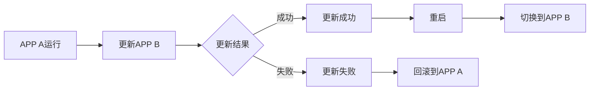
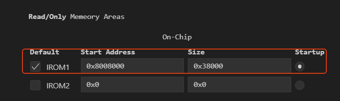
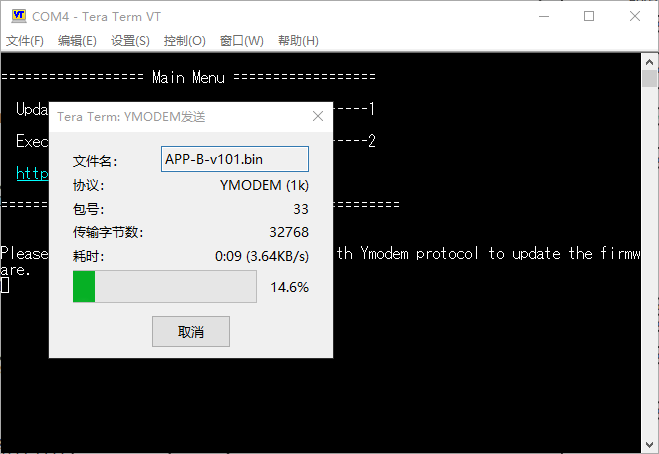
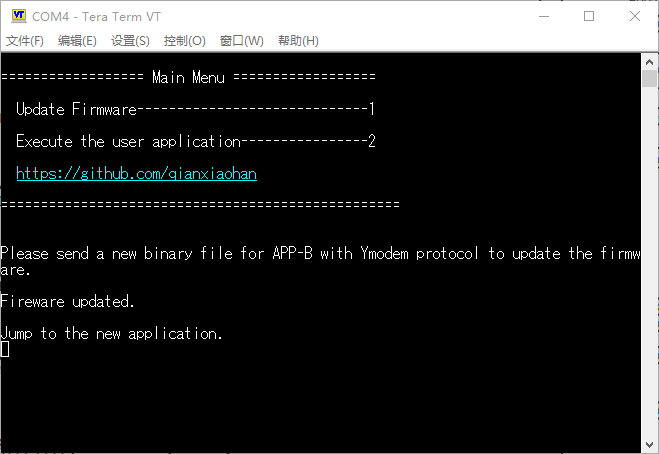

## :electric_plug:UART IAP升级

在本项目中，将应用程序划分成了双分区，一个分区用于当前程序运行，另一个程序用于备份和更新。

特点：

- 采用双分区，有效避免升级失败造成应用程序的崩溃，升级失败会回滚到上一版本
- 两个分区互不干扰，均可独立运行，更新和运行区来回切换。
- 在更新固件时，上位机会提示发送哪个分区的固件，由软件决定新固件写入的地址。
- 更新逻辑



在这个项目中编写了一个简易的Bootloader，Bootloader会根据FLASH存储的标志位，来判断启动哪个分区的APP。

`Bootloader`，`APP`，以及`程序标志位`在片上FLASH的分区情况如下，其中：

- Bootloader (16KB)
- 程序标志位 (16KB)
- APP A (224KB)
- APP B (256KB)

| 扇区   | 起始地址   | 结束地址   | 大小   | 归属           |
| ------ | ---------- | ---------- | ------ | -------------- |
| 扇区 0 | 0x08000000 | 0x08003FFF | 16 KB  | **Bootloader** |
| 扇区 1 | 0x08004000 | 0x08007FFF | 16 KB  | **程序标志位** |
| 扇区 2 | 0x08008000 | 0x0800BFFF | 16 KB  | **App A**      |
| 扇区 3 | 0x0800C000 | 0x0800FFFF | 16 KB  | **App A**      |
| 扇区 4 | 0x08010000 | 0x0801FFFF | 64 KB  | **App A**      |
| 扇区 5 | 0x08020000 | 0x0803FFFF | 128 KB | **App A**      |
| 扇区 6 | 0x08040000 | 0x0805FFFF | 128 KB | **App B**      |
| 扇区 7 | 0x08060000 | 0x0807FFFF | 128 KB | **App B**      |

**Bootlader的程序：**[bootloader](https://github.com/qianxiaohan/STM32-Bootloader)

两个APP需修改的地方：

1. 项目中添加宏定义`USER_VECT_TAB_ADDRESS`,     在 `system_stm32f4xx.c`找到，`VECT_TAB_OFFSET`，设置APP A设置为`0x00008000U`，APP B设置为`0x08040000`

```c
#if defined(USER_VECT_TAB_ADDRESS)
/*!< Uncomment the following line if you need to relocate your vector Table
     in Sram else user remap will be done in Flash. */
/* #define VECT_TAB_SRAM */
#if defined(VECT_TAB_SRAM)
#define VECT_TAB_BASE_ADDRESS   SRAM_BASE       /*!< Vector Table base address field.
                                                     This value must be a multiple of 0x200. */
#define VECT_TAB_OFFSET         0x00000000U     /*!< Vector Table base offset field.
                                                     This value must be a multiple of 0x200. */
#else
#define VECT_TAB_BASE_ADDRESS   FLASH_BASE      /*!< Vector Table base address field.
                                                     This value must be a multiple of 0x200. */
#define VECT_TAB_OFFSET         0x00008000U     /*!< Vector Table base offset field.
                                                     This value must be a multiple of 0x200. */
#endif /* VECT_TAB_SRAM */
#endif /* USER_VECT_TAB_ADDRESS */
```

2. 修改FLASH布局，在Keil或者EIDE设置。 
   - APP A：IROM1 `0x08008000`   	Size `0x38000`
   - APP A：IROM1 `0x08040000`   	Size `0x40000`



## :clapper:效果演示

在软件Tera Term上，利用UART3连接至该软件。使用Ymodem(1K)协议，发送固件至STM32。

**更新固件**：



上位机提示发送APP B所在项目的编译生成的新bin文件，**更新成功后跳转到新程序**

