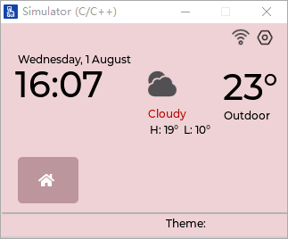
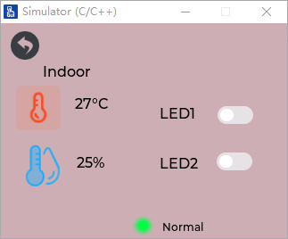
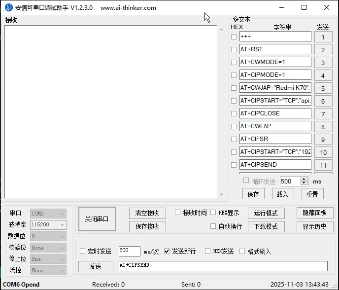

# STM32-SmartHub

## :dart:实现功能

1. :white_check_mark:使用ESP8266-01S获取天气，将数据转发给STM32，并通过LCD显示出`最高温度`、`最低温度`、`当前温度`、`天气`
2. :white_check_mark:ESP8266-01S使用AT指令获取SNTP时间，对本地RTC校准，通过LCD显示`当前小时、分钟`，`日期`
3. :white_check_mark:通过LCD触摸板控制LED灯
4. :white_check_mark:定时更新天气（已更新)
5. :construction:一些外设模块，例如温湿度模块（待更新）
6. :white_check_mark:UART IAP升级（已更新）
7. :construction:Wi-Fi OTA升级（待更新）

## :wrench:介绍

- 开发环境：VSCode + EIDE插件，STM32CUBEMX生成代码

- 主控芯片：STM32F407VET6
- 外设：
  - ESP8266-01S WIFI模块
  - TFT LCD 2.8寸
  - USB TO TTL（用于调试）
  - 待拓展....
- 操作系统：FreeRTOS
- 图形界面框架：使用Gui Guider设计界面，生成LVGL v8.3代码

连线如下表所示：

| STM32接线 | ESP8266 | USB TO TTL |
| --------- | ------- | ---------- |
| PA9       | RX      |            |
| PA10      | TX      |            |
| PB10      |         | RX         |
| PB11      |         | TX         |

界面设计如下：

**主界面**



**子界面**



### :warning:注意

- 优先初始化esp8266，再初始化LCD，最后启动freertos调度器

- ESP8266初始化：发送数据使用串口阻塞模式，接收数据使用串口空闲中断+DMA2接收
- 等待初始化完成后，打开DMA2的发送（在裸机时，使用阻塞模式向esp8266发送数据，工作量太大就沿用了之前的代码），向服务器发送指令使用DMA2发送。
- 向串口助手发送数据（用于调试）使用DMA2发送

### :file_folder:文件结构

```
Core/
└── Inc/
    ├── delay.h					//延时函数，移植LCD时，直接复制过来的
    ├── dma.h					//DMA驱动，CUBEMX生成
    ├── esp8266.h				//esp8266初始化、连接网络等等
    ├── FreeRTOSConfig.h		//freertos配置文件，CUBEMX生成
    ├── fsmc.h					//工程中没有使用该文件
    ├── gpio.h					//GPIO相关代码，CUBEMX生成
    ├── lcd.h					//LCD驱动相关代码，移植已有工程
    ├── lcdfont.h				//LCD字体，移植已有工程
    ├── main.h					//CUBEMX生成，定义了一些宏
    ├── norflash.h				//直接移植已有工程，触摸屏所需文件
    ├── rtc.h					//rtc驱动代码，CUBEMX生成
    ├── spi.h					//直接移植已有工程，触摸屏所需文件
    ├── stm32f4xx_hal_conf.h	//CUBEMX生成
    ├── stm32f4xx_it.h			//串口空闲中断相关代码
    ├── touch.h					//触摸板驱动代码
    ├── usart.h					//串口相关代码
    └── weather.h				//解析天气相关代码
 	└── Src/					//上面头文件对应的C文件
Middlewares/
└── Third_Party/
    └── LVGL/
    	└── LVGL_SRC/			//lvgl官方库
        └── UI/					//GUI Guider生成的代码
            ├── custom/      // 自定义UI组件/样式目录
            └── generated/   // 自动生成的UI代码目录（如SquareLine Studio导出）
```


### :memo:功能介绍

| 功能                   | 细节介绍                                       |
| ---------------------- | ---------------------------------------------- |
| 解析天气               | [parse_weather.md](./Details/parse_weather.md) |
| LCD显示(FreeRTOS+LVGL) | [lcd_lvgl.md](./Details/lcd_lvgl.md)           |
| UART IAP升级固件       | [uart_iap.md](./Details/uart_iap.md)           |

**Bootlader的程序：**[bootloader](https://github.com/qianxiaohan/STM32-Bootloader)

## :clapper:实现效果

在串口助手中输出调试内容：



## 参考资料

1. AT指令集：https://docs.espressif.com/projects/esp-at/zh_CN/latest/esp32/AT_Command_Set/index.html
1. https://github.com/ferenc-nemeth/stm32-bootloader
1. https://www.bilibili.com/video/BV1eh4y167JT/?spm_id_from=333.337.search-card.all.click&vd_source=6bbe567a937651b36fb7c735bfdbb85a

